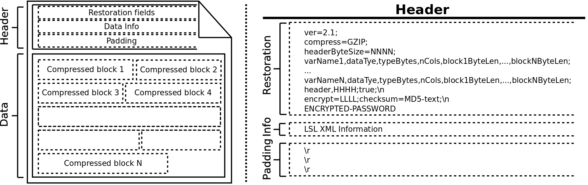

# LSL Recorder

LSL Recorder is a multi-thread, cross-platform software developed using Java technology (version 1.7) and [Lab Streaming Layer](https://github.com/sccn/labstreaminglayer) based on [CLIS](https://github.com/manmermon/CLIS) focused on recording digital signals for offline data analysis.

<div align="center">
    
</div>

The project's struct:
```
LSLRecorder
|
|-- ImportClisData: To import data from CLIS format.
|   |
|   |-- Java
|   |-- Matlab
|   |-- Python
|
|-- LSLRecorder/src: source code.
|
|-- Lang: language files.
|
|-- Readme: used images in this readme file.
|
|-- lib: .jar libraries.
|
|-- systemLib: libraries of functions dependent on the operating system.
|
|-- LSLRecorder.zip: zip file with LSLRecorder.jar (runnable) and the folder systemLib.
```

To use LSLRecorder, you have to download and unzip LSLRecorder.zip. This contains two file: *LSLRecorder.jar* and the folder *systemLib*. They both must be the same directory. The sentence to run LSLRecorder is: 

**java -jar LSLRecorder.jar** 


## File Format

The output file format of LSL Recorder is the version 2.1 from [CLIS](https://github.com/manmermon/CLIS). The import data files are available in the folder [ImportClisData](https://github.com/manmermon/LSLRecorder/tree/master/ImportClisData). The next <a href="#file_format">figure</a> shows its struct. This is split in two parts: data block (binary values) and header (text in UTF-8 format). 

<div align="center" id="file_format">
    
</div>

### Header

Header contains all information to restore original data. This is split in 3 parts: restoration fields, data information, and padding. The <a href="file_format">previous figure</a> shows this scheme. 


#### Restoration Fields

Block of restoration fields is a single text line ending with the special character *end of line* (*\n*). This contain all information to restore original data. Each field is split by a semicolon. The three firsts identify version, compression technique, and byte size of header, and the last one indicates if data information block is present. The other middle fields are referenced to data blocks. In these, the different subfields are separated by a comma, such that, the meaning (in order) is: 

- varName: name of data stream. 
- dataType: data type. Three exclusive options: int (integer), float, and char (character). 
- typeBytes: number of bytes of data type. This way, a double value and a 32-bit integer are identified as "float,8", and "int,4". 
- nCols: data streaming are structured as a NxM matrix. The number of columns is identified in this subfiled. 
- block1ByteLen,...,blockNByteLen: number of bytes of each input 10MiB-data segments after compression algorithm.

The order in which each data-block field appears indicates their order in the file.

The last field of the first text line of restoration information shows whether the extension is available. A value equal to *true* indicates complementary information to restore data blocks is contained in the next text line. Version 2.1 of *CLIS* format is compounded by 2 fields separated by a semicolon. The first one indicates the length (in bytes) of the saved symmetric-encryption key after the next *\n*. This is encrypted, so it is advisable to check that the decryption key is the same (in the <a href="file_format">previous figure</a>, the encryption key is indicated by the string *ENCRYPTED-PASSWORD*). The second field contains an MD5-checksum code of encrypted-compressed data. The steps to generate it are: firstly data block (one by one), and then, CLIS header without the checksum code and padding (in the <a href="file_format">previous figure</a>, the checksum code is indicated by the string *MD5-text*).

#### Data Information

Data information block includes comments about data, and it is optional. This must be a single text line ending with the special character *end of line* (*\n*). In LSL Recorder, this contains LSL streaming information in XML format. This text is encrypted if the user sets an encrypt key.

#### Padding

Numbers of compressed blocks and the length of each one are unknown at the beginning of convert processing. This fact causes that the number of characters of *restoration fields* is initially unknown. The target of the padding is to reserve enough memory space to insert the two previous header blocks at the beginning of output file, after data compression process is finished, without overwriting compressed data blocks. The header byte size is estimated based on the worst of case (uncompressed data for each 5MiB segment), and the special character *carriage return* (*\r*) is inserted until the estimation is reached.

The process to convert the temporal input binary file data to output data file are split in 3 parts: 1) insert the padding to reserve the bytes for the header, 2) compress and save the input data files (in our case, the data file and the time stamp file), and 3) write the header file at the beginning.

### Data Block 

The data block consists of a sequence of compressed 10MiB-data segments. LSLRecorder currently supports two compression techniques: GZIP (default) and BZIP2. Each compressed block is encrypted if the user sets an encrypt key. 

The process to convert the temporary input binary file data to the output data file is split into 3 parts: 1) insert the padding to reserve the header, 2) compress, encrypt and save the input binary data file, and 3) write the header file at the beginning. 
