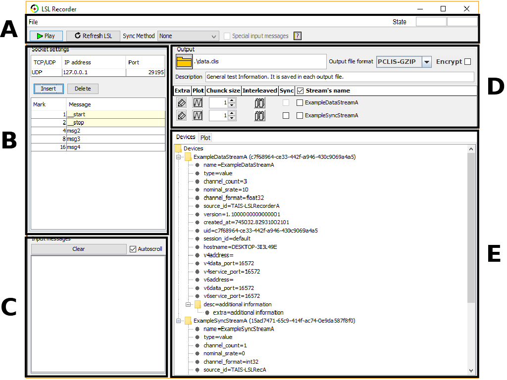
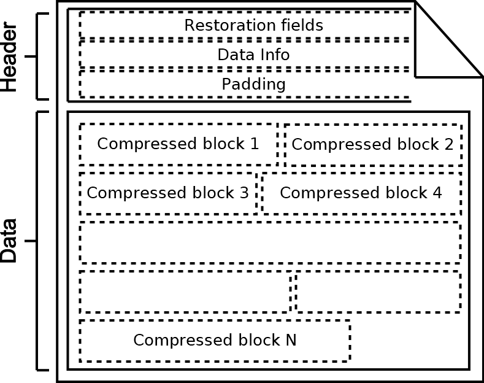

# LSL Recorder

LSL Recorder is a multi-thread, cross-platform software developed using Java technology (version 1.7) and [Lab Streaming Layer](https://github.com/sccn/labstreaminglayer) based on [CLIS](https://github.com/manmermon/CLIS) focused on recording digital signals for offline data analysis.

    

LSL Recorder employs the next Java libraries:

- [jcommon-1.0.23.jar](https://sourceforge.net/projects/jfreechart/files/3.%20JCommon/1.0.23/) (graphic; License LGPL).
- [jfreechart-1.0.19.jar](https://sourceforge.net/projects/jfreechart/files/1.%20JFreeChart/1.0.19/) (graphic; License LGPL).
- [jna-5.3.1.jar](repo1.maven.org/maven2/net/java/dev/jna/jna/5.3.1/jna-5.3.1.jar) (LSL requirement; Licenses LGPL 2.1 or later and 
Apache License 2.0).
<!-- - [jgt-jgrassgears-0.7.6.jar](https://mvnrepository.com/artifact/org.jgrasstools/jgt-jgrassgears/0.7.6)-->
<!-- - [jts-1.12.jar](https://mvnrepository.com/artifact/com.vividsolutions/jts/1.12)--> 

## File Format

The output file format of LSL Recorder is the version 2 from [CLIS](https://github.com/manmermon/CLIS). The import data files are available in the folder [ImportClisData](https://github.com/manmermon/LSLRecorder/tree/master/ImportClisData). The next <a href="#file_format">figure</a> shows its struct. This is split in two parts: data block (binary values) and header (text in UTF-8 format). 

    

### Data Block 

Sequence of compress block. Each block is the output of GZip compression technique applies to data segments of 5 MiB.

### Header

Header contains all information to restore original data. This is split in 3 parts: restoration fields, data information, and padding. The next <a href="header_file">figure</a> shows this scheme. 

    

#### Restoration Fields

Block of restoration fields is a single text line ending with the special character ``end of line'' ($\backslash n$). This contain all information to restore original data. Each field is split by a semicolon. The three firsts identify version, compression technique, and byte size of header, and the last one indicates if data information block is present. The other middle fields are referenced to data blocks. In these, the different subfields are separated by a comma, such that, the meaning (in order) is: 

- varName: name of data stream. 
- dataType: data type. Three exclusive options: int (integer), float, and char (character). 
- typeBytes: number of bytes of data type. This way, a double value and a 32-bit integer are identified as "float,8", and "int,4". 
- nCols: data streaming are structured as a NxM matrix. The number of columns is identified in this subfiled. 
- block1ByteLen,...,blockNByteLen: number of bytes of each input 5MiB-data segments after compression algorithm.

#### Data Information

Data information block includes comments about data, and it is optional. This must be a single text line ending with the special character "end of line" (\n). In LSL Recorder, this contains LSL streaming information in XML format.

#### Padding

Numbers of compressed blocks and the length of each one are unknown at the beginning of convert processing. This fact causes that the number of characters of <i>restoration fields</i> is initially unknown. The target of the padding is to reserve enough memory space to insert the two previous header blocks at the beginning of output file, after data compression process is finished, without overwriting compressed data blocks. The header byte size is estimated based on the worst of case (uncompressed data for each 5MiB segment), and the special character "carriage return" (\r) is inserted until the estimation is reached.

The process to convert the temporal input binary file data to output data file are split in 3 parts: 1) insert the padding to reserve the bytes for the header, 2) compress and save the input data files (in our case, the data file and the time stamp file), and 3) write the header file at the beginning.
